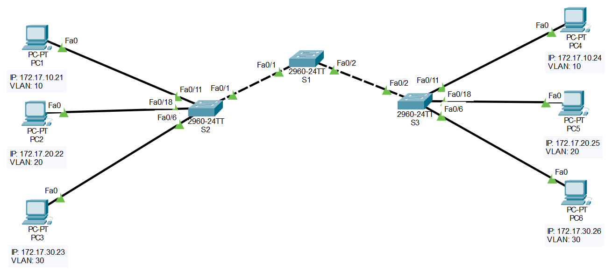

# 🔀 Lab01 — Redes con VLANs

> Laboratorio 01 — Redes y Comunicación de Datos II | UTP Lima


---

## 📝 Descripción

Laboratorio de configuración de **VLANs** en switches Cisco, incluyendo asignación de puertos, configuración de enlaces troncales y verificación de conectividad entre hosts de distintas VLANs.

---

## 🗺️ Topología de red



| Dispositivo | Modelo | Puertos usados |
|---|---|---|
| S1 | Cisco 2960-24TT | Fa0/1, Fa0/2 (trunk) |
| S2 | Cisco 2960-24TT | Fa0/1 (trunk), Fa0/6, Fa0/11, Fa0/18 |
| S3 | Cisco 2960-24TT | Fa0/2 (trunk), Fa0/6, Fa0/11, Fa0/18 |

| PC | IP | VLAN |
|---|---|---|
| PC1 | 172.17.10.21 | VLAN 10 |
| PC2 | 172.17.20.22 | VLAN 20 |
| PC3 | 172.17.30.23 | VLAN 30 |
| PC4 | 172.17.10.24 | VLAN 10 |
| PC5 | 172.17.20.25 | VLAN 20 |
| PC6 | 172.17.30.26 | VLAN 30 |

---

## 🎯 Objetivos

- Cablear una red según diagrama de topología
- Configurar switches desde estado predeterminado
- Crear y nombrar VLANs en múltiples switches (S1, S2, S3)
- Asignar puertos de switch a VLANs específicas
- Configurar enlaces troncales entre switches
- Verificar conectividad entre hosts mediante `ping`
- Mover hosts entre VLANs y verificar comportamiento

---

## 🧠 Conceptos aplicados

| Concepto | Detalle |
|---|---|
| 🏷️ VLANs | Segmentación lógica en VLAN 10, 20 y 30 |
| 🔗 Trunk Links | Enlace troncal S2↔S1↔S3 |
| 🌐 VLAN de administración | Asignación de VLAN para gestión del switch |
| 📡 Ping entre hosts | Verificación de conectividad entre PCs de misma VLAN |
| 💾 Guardado de configuración | Persistencia de configuración en los switches |

---

## 📁 Contenido

```
Lab01_Redes_con_VLANS/
│
├── *.pkt           # Archivo de topología Cisco Packet Tracer
├── topologia.png   # Diagrama de red
└── README.md
```

---

## 🚀 ¿Cómo abrir el laboratorio?

1. Instala [Cisco Packet Tracer](https://www.netacad.com/courses/packet-tracer)
2. Abre el archivo `.pkt` incluido en esta carpeta
3. Explora la topología y configuraciones aplicadas

---

## 🔙 Volver al índice

[← Volver al repositorio principal](../README.md)
