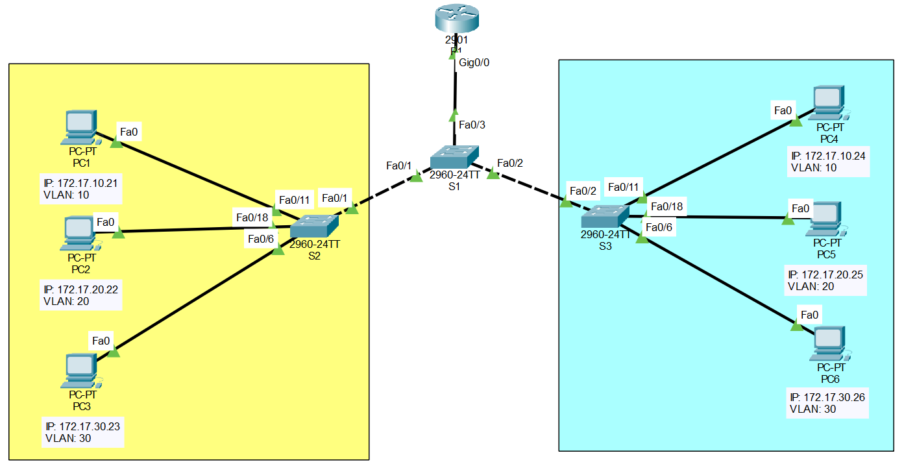

# 🔀 Lab02 — Enrutamiento de VLAN (Router on Stick)

> Laboratorio 02 — Redes y Comunicación de Datos II | UTP Lima


---

## 📝 Descripción

Laboratorio de **enrutamiento entre VLANs** usando el método **Router on Stick**, extendiendo la topología del Lab01. Se agrega un router Cisco 2901 conectado al switch S1 mediante un enlace troncal 802.1Q, permitiendo la comunicación entre hosts de diferentes VLANs.

---

## 🗺️ Topología de red



| Dispositivo | Modelo | Rol |
|---|---|---|
| R1 | Cisco 2901 | Router — Enrutamiento entre VLANs |
| S1 | Cisco 2960-24TT | Switch central — Trunk hacia R1 |
| S2 | Cisco 2960-24TT | Switch Piso 1 |
| S3 | Cisco 2960-24TT | Switch Piso 2 |

| Subinterfaz | VLAN | Gateway |
|---|---|---|
| Gi0/0.10 | VLAN 10 | 172.17.10.1 |
| Gi0/0.20 | VLAN 20 | 172.17.20.1 |
| Gi0/0.30 | VLAN 30 | 172.17.30.1 |
| Gi0/0.99 | VLAN 99 (nativa) | 172.17.99.1 |

---

## 🎯 Objetivos

- Añadir un router Cisco 2901 a la topología del Lab01
- Configurar el puerto Fa0/3 del switch S1 en modo troncal
- Configurar subinterfaces en el router con encapsulación dot1Q
- Habilitar comunicación entre hosts de distintas VLANs
- Verificar conectividad con ping entre PC1↔PC5 y PC3↔PC4

---

## 🧠 Conceptos aplicados

| Concepto | Detalle |
|---|---|
| 🔀 Router on Stick | Un único enlace físico con múltiples subinterfaces |
| 🏷️ Encapsulación 802.1Q | Etiquetado de tráfico por VLAN en el enlace troncal |
| 🌐 Subinterfaces | `Gi0/0.10`, `Gi0/0.20`, `Gi0/0.30`, `Gi0/0.99` |
| 🔗 Trunk Link | Puerto Fa0/3 de S1 configurado en modo troncal |
| 📡 Ping intervlan | Verificación de conectividad entre diferentes VLANs |

---

## ⚙️ Configuración clave

**Switch S1 — Puerto troncal hacia el router:**
```
interface FastEthernet0/3
 switchport trunk native vlan 99
 switchport mode trunk
```

**Router R1 — Subinterfaces dot1Q:**
```
interface GigabitEthernet0/0.10
 encapsulation dot1Q 10
 ip address 172.17.10.1 255.255.255.0

interface GigabitEthernet0/0.20
 encapsulation dot1Q 20
 ip address 172.17.20.1 255.255.255.0

interface GigabitEthernet0/0.30
 encapsulation dot1Q 30
 ip address 172.17.30.1 255.255.255.0
```

---

## 📁 Contenido

```
Lab02_Enrutamiento_de_VLAN/
│
├── Enrutamiento_de_VLAN.pkt   # Topología Cisco Packet Tracer
├── topologia.png              # Diagrama de red
└── README.md
```

---

## 🚀 ¿Cómo abrir el laboratorio?

1. Instala [Cisco Packet Tracer](https://www.netacad.com/courses/packet-tracer)
2. Abre el archivo `Enrutamiento_de_VLAN.pkt`
3. Explora la topología y verifica la conectividad entre VLANs

---

## 🔙 Volver al índice

[← Volver al repositorio principal](../README.md)
