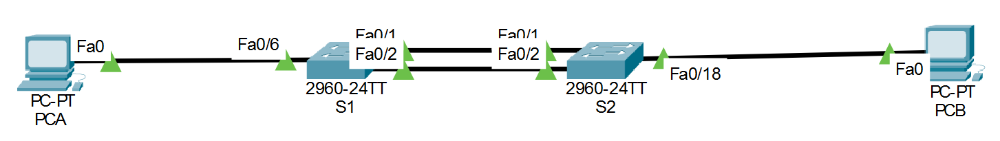

# 🔗 Lab03 — STP y EtherChannel

> Laboratorio 03 — Redes y Comunicación de Datos II | UTP Lima


---

## 📝 Descripción

Laboratorio de configuración e implementación de **EtherChannel** y **STP (Spanning Tree Protocol)** en switches Cisco, permitiendo agregar múltiples enlaces físicos en uno lógico y gestionar la redundancia en la red para evitar bucles.

---

## 🗺️ Topología de red



---

## 🎯 Objetivos

- Implementar EtherChannel entre switches
- Configurar y verificar el funcionamiento de STP
- Entender la redundancia de enlaces en redes conmutadas
- Verificar conectividad y estabilidad de la topología

---

## 🧠 Conceptos aplicados

| Concepto | Detalle |
|---|---|
| 🔗 EtherChannel | Agregación de múltiples enlaces físicos en uno lógico |
| 🌳 STP | Spanning Tree Protocol — prevención de bucles en la red |
| 🔄 Redundancia | Tolerancia a fallos mediante enlaces redundantes |
| 🏷️ VLANs | Integración con la configuración de VLANs previas |
| ✅ Verificación | Comprobación de conectividad y estado de los protocolos |

---

## 📁 Contenido

```
Lab03_STP_y_EtherChannel/
│
├── *.pkt          # Archivo de topología Cisco Packet Tracer
├── topologia.png  # Diagrama de red
└── README.md
```

---

## 🚀 ¿Cómo abrir el laboratorio?

1. Instala [Cisco Packet Tracer](https://www.netacad.com/courses/packet-tracer)
2. Abre el archivo `.pkt` incluido en esta carpeta
3. Explora la topología y configuraciones aplicadas

---
## 🔙 Volver al índice

[← Volver al repositorio principal](../README.md)
