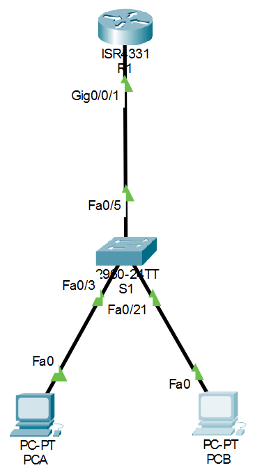

# 📡 Lab04 — Implementación del Servicio DHCP

> Laboratorio 04 — Redes y Comunicación de Datos II | UTP Lima


---

## 📝 Descripción

Laboratorio de configuración del **servicio DHCP** en un router Cisco, integrando VLANs y el método Router on Stick para asignar direcciones IP dinámicas a PCs en distintas VLANs de una red empresarial.

---

## 🗺️ Topología de red



---

## 🎯 Objetivos

- Configurar parámetros básicos del switch y router
- Crear VLANs y asignar puertos en el switch
- Configurar el router como servidor DHCP para múltiples VLANs
- Verificar que las PCs obtengan IPs de forma dinámica

---

## 🧠 Conceptos aplicados

| Concepto | Detalle |
|---|---|
| 📡 DHCP Server | Router R1 como servidor DHCP para VLAN 35 y VLAN 46 |
| 🏷️ VLANs | VLAN 35 (usuarios) y VLAN 46 (sistemas) |
| 🔀 Router on Stick | Subinterfaces `G0/0/1.35` y `G0/0/1.46` con encapsulación dot1Q |
| 🚫 IPs excluidas | Reserva de IPs para dispositivos de red y servidores |
| 🌐 DNS | Dominio `cisco.com` con servidor DNS por VLAN |

---

## 🖥️ Direccionamiento IP

| Dispositivo | Interfaz / VLAN | IP | Máscara |
|---|---|---|---|
| R1 | G0/1.35 | 192.168.35.1 | 255.255.255.0 |
| R1 | G0/1.46 | 192.168.46.1 | 255.255.255.0 |
| S1 | VLAN 99 (nativa) | 192.168.99.201 | 255.255.255.0 |
| PC-A | VLAN 35 (usuarios) | DHCP | DHCP |
| PC-B | VLAN 46 (sistemas) | DHCP | DHCP |

---

## ⚙️ Configuración clave

**Switch S1:**
```
vlan 35 → name usuarios
vlan 46 → name sistemas
int f0/3 → switchport access vlan 35
int f0/21 → switchport access vlan 46
int f0/5 → switchport mode trunk
```

**Router R1 — Pools DHCP:**
```
ip dhcp pool usuarios
 network 192.168.35.0 255.255.255.0
 default-router 192.168.35.1
 dns-server 192.168.35.200
 domain-name cisco.com

ip dhcp pool sistemas
 network 192.168.46.0 255.255.255.0
 default-router 192.168.46.1
 dns-server 192.168.46.200
 domain-name cisco.com
```

---

## 📁 Contenido

```
Lab04_Implementacion_DHCP/
│
├── *.pkt          # Archivo de topología Cisco Packet Tracer
├── topologia.png  # Diagrama de red
└── README.md
```

---

## 🚀 ¿Cómo abrir el laboratorio?

1. Instala [Cisco Packet Tracer](https://www.netacad.com/courses/packet-tracer)
2. Abre el archivo `.pkt` incluido en esta carpeta
3. Verifica que PC-A y PC-B obtengan IPs dinámicas

---

## 🔙 Volver al índice

[← Volver al repositorio principal](../README.md)
