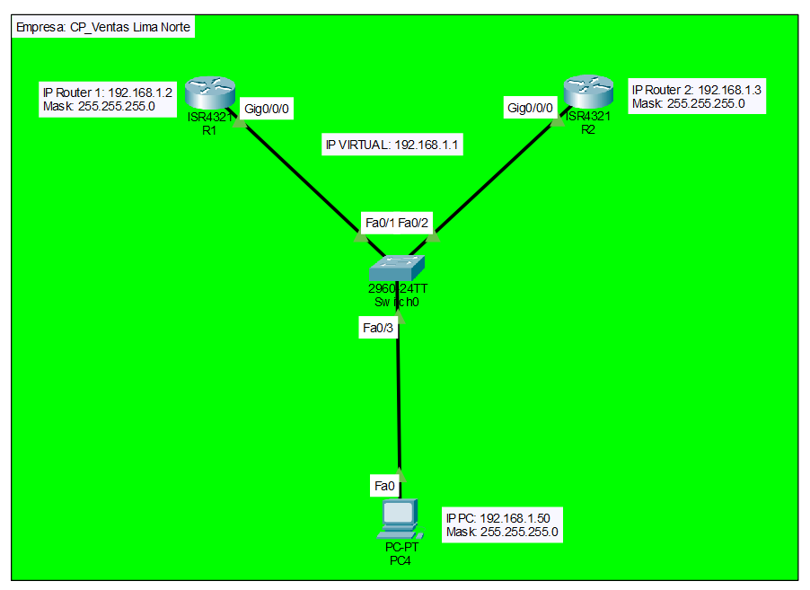

# 🔁 Lab05 — Implementación del Protocolo HSRP

> Laboratorio 05 — Redes y Comunicación de Datos II | UTP Lima


---

## 📝 Descripción

Laboratorio de configuración del protocolo **HSRP (Hot Standby Router Protocol)** en routers Cisco, implementando redundancia de gateway para garantizar alta disponibilidad en la red ante la caída de un router.

---

## 🗺️ Topología de red



---

## 🎯 Objetivos

- Configurar parámetros básicos de los dispositivos
- Configurar IPs en los routers
- Configurar HSRP en las interfaces de los routers
- Realizar prueba de conectividad con ping constante a la IP virtual
- Simular caída del Router01 cortando el cable del Switch

---

## 🧠 Conceptos aplicados

| Concepto | Detalle |
|---|---|
| 🔁 HSRP | Hot Standby Router Protocol — redundancia de gateway |
| 🌐 IP Virtual | Dirección IP compartida entre routers activo y standby |
| 📡 Failover | Simulación de caída de router y recuperación automática |
| 🔌 Redundancia | Alta disponibilidad ante fallos de enlace |
| ✅ Ping constante | Verificación de conectividad durante la conmutación |

---

## 📁 Contenido

```
Lab05_Protocolo_HSRP/
│
├── *.pkt          # Archivo de topología Cisco Packet Tracer
├── topologia.png  # Diagrama de red
└── README.md
```

---

## 🚀 ¿Cómo abrir el laboratorio?

1. Instala [Cisco Packet Tracer](https://www.netacad.com/courses/packet-tracer)
2. Abre el archivo `.pkt` incluido en esta carpeta
3. Simula la caída del Router01 y verifica la conmutación HSRP

---

## 🔙 Volver al índice

[← Volver al repositorio principal](../README.md)
