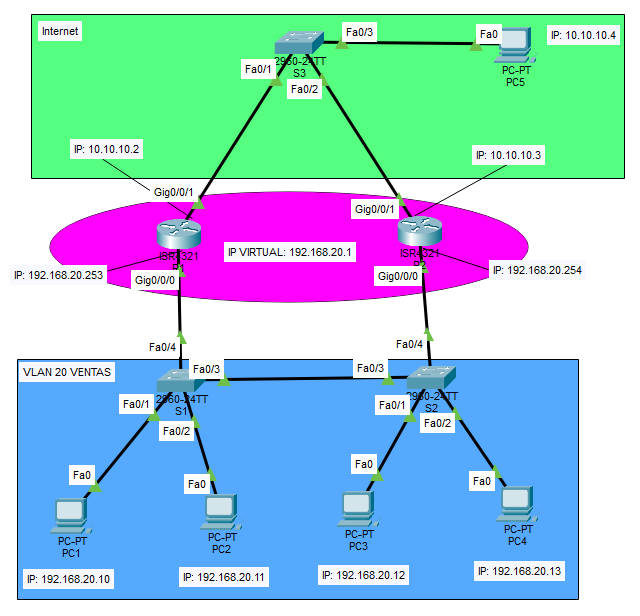

# 🏆 Lab06 — HSRP Avanzado (Reto)

> Laboratorio 06 — Redes y Comunicación de Datos II | UTP Lima


---

## 📝 Descripción

Reto de implementación avanzada de **HSRP** con topología empresarial de tres capas. Dos routers ISR4321 comparten una **IP virtual** como gateway de la VLAN 20 (Ventas), garantizando alta disponibilidad. Incluye conexión hacia Internet mediante un switch S3 y análisis de fallas en la topología.

---

## 🗺️ Topología de red



---

## 🎯 Objetivos

- Configurar parámetros básicos de los dispositivos
- Configurar IPs en los routers y subinterfaces
- Configurar HSRP con IP virtual compartida entre routers
- Realizar prueba de conectividad con ping constante a la IP virtual
- Simular caída del Switch S3 hacia el Router0
- Identificar y documentar las fallas de la topología

---

## 🧠 Conceptos aplicados

| Concepto | Detalle |
|---|---|
| 🔁 HSRP | IP Virtual 192.168.20.1 compartida entre Router1 y Router2 |
| 🏷️ VLAN 20 | Red de Ventas — PCs con IPs 192.168.20.10 a .13 |
| 🔀 Subinterfaces | `Gig0/0/0` y `Gig0/0/1` en cada router |
| 🌐 Internet | Red 10.10.10.0/24 conectada via Switch S3 |
| 📡 Failover | Conmutación automática ante caída de un router |
| 🔍 Análisis de fallos | Identificación de puntos débiles en la topología |

---

## 🖥️ Direccionamiento IP

| Dispositivo | Interfaz | IP |
|---|---|---|
| Router1 | Gig0/0/0 | 192.168.20.253 |
| Router2 | Gig0/0/0 | 192.168.20.254 |
| HSRP | IP Virtual | 192.168.20.1 |
| PC1 | VLAN 20 | 192.168.20.10 |
| PC2 | VLAN 20 | 192.168.20.11 |
| PC3 | VLAN 20 | 192.168.20.12 |
| PC4 | VLAN 20 | 192.168.20.13 |
| PC5 | Internet | 10.10.10.4 |
| S3 | Internet | 10.10.10.2 / 10.10.10.3 |

---

## 📁 Contenido

```
Lab06_HSRP_Avanzado/
│
├── Redundancia_HSRP.pkt   # Archivo de topología Cisco Packet Tracer
├── topologia.png           # Diagrama de red
└── README.md
```

---

## 🚀 ¿Cómo abrir el laboratorio?

1. Instala [Cisco Packet Tracer](https://www.netacad.com/courses/packet-tracer)
2. Abre el archivo `Redundancia_HSRP.pkt`
3. Simula la caída de un router y verifica la conmutación HSRP

---

## 🔙 Volver al índice

[← Volver al repositorio principal](../README.md)
