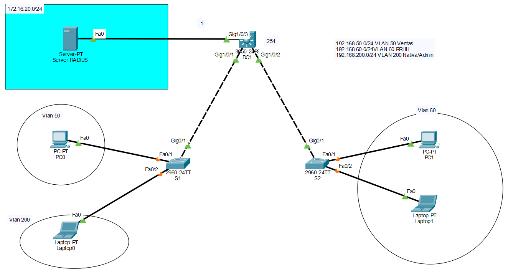

# 🔐 Lab07 — Seguridad en el Acceso (SSH y RADIUS)

> Laboratorio 07 — Redes y Comunicación de Datos II | UTP Lima


---

## 📝 Descripción

Laboratorio de implementación de **seguridad en el acceso** a dispositivos de red, configurando acceso remoto mediante **SSH** y autenticación centralizada con un **servidor RADIUS** usando el protocolo 802.1X.

---

## 🗺️ Topología de red



---

## 🎯 Objetivos

- Configurar VLANs y modos de puertos en switches
- Configurar subinterfaces en el router
- Configurar SSH en routers y switches
- Configurar acceso remoto mediante `line vty 0 4`
- Realizar acceso remoto desde PC hacia router y switch via SSH
- Implementar control de acceso basado en servidor RADIUS con 802.1X

---

## 🧠 Conceptos aplicados

| Concepto | Detalle |
|---|---|
| 🔐 SSH v2 | Acceso remoto seguro a routers y switches |
| 🏷️ VLANs | VLAN 50 (Ventas), VLAN 60 (RRHH), VLAN 200 (Nativa/Admin) |
| 🌐 DHCP | Pools por VLAN configurados en Switch DC1 |
| 🖥️ RADIUS | Servidor en 172.16.20.2, autenticación 802.1X |
| 🔑 AAA | `aaa new-model` con autenticación dot1x |
| 📡 Subinterfaces | Enrutamiento inter-VLAN en Switch DC1 con `ip routing` |

---

## 🖥️ Direccionamiento IP

| Dispositivo | Interfaz / VLAN | IP |
|---|---|---|
| Switch DC1 | VLAN 50 | 192.168.50.254/24 |
| Switch DC1 | VLAN 60 | 192.168.60.254/24 |
| Switch DC1 | VLAN 200 | 192.168.200.254/24 |
| Switch S1 | VLAN 200 | 192.168.200.2/24 |
| Switch S2 | VLAN 200 | 192.168.200.3/24 |
| Server RADIUS | Fa0 | 172.16.20.2 |
| PC0 | VLAN 50 | DHCP |
| PC1 | VLAN 60 | DHCP |
| Laptop0 | VLAN 200 | DHCP |
| Laptop1 | VLAN 60 | DHCP |

---

## ⚙️ Configuración clave

**SSH en Switch S1:**
```
ip domain-name cisco.com
crypto key generate rsa
username admin secret ccna
line vty 0 15
 transport input ssh
 login local
ip ssh version 2
```

**RADIUS + 802.1X:**
```
aaa new-model
aaa authentication dot1x default group radius
radius-server host 172.16.20.2 auth-port 1645
radius-server key cisco1234
dot1x system-auth-control
interface fastEthernet 0/1
 switchport mode access
 authentication port-control auto
 dot1x pae authenticator
```

---

## 📁 Contenido

```
Lab07_Seguridad_Acceso_SSH_RADIUS/
│
├── *.pkt          # Archivo de topología Cisco Packet Tracer
├── topologia.png  # Diagrama de red
└── README.md
```

---

## 🚀 ¿Cómo abrir el laboratorio?

1. Instala [Cisco Packet Tracer](https://www.netacad.com/courses/packet-tracer)
2. Abre el archivo `.pkt` incluido en esta carpeta
3. Verifica el acceso remoto SSH desde PC hacia router y switch

---

## 🔙 Volver al índice

[← Volver al repositorio principal](../README.md)
