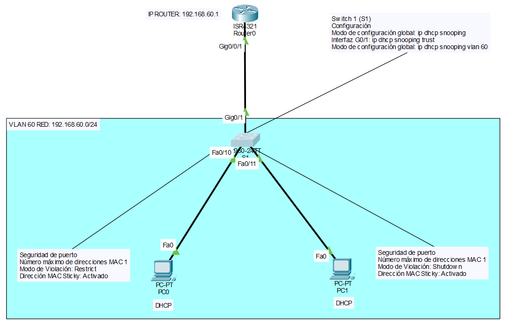

# 🛡️ Lab08 — Seguridad de Puertos

> Laboratorio 08 — Redes y Comunicación de Datos II | UTP Lima


---

## 📝 Descripción

Laboratorio de configuración de **seguridad de puertos** en switches Cisco, implementando restricciones de acceso por dirección MAC, modos de violación y DHCP Snooping para proteger la red contra accesos no autorizados.

---

## 🗺️ Topología de red



---

## 🎯 Objetivos

- Configurar VLANs y modos de puertos en switches
- Configurar seguridad de puertos con direcciones MAC sticky
- Configurar subinterfaces en el router
- Configurar servidor DHCP en el router
- Implementar DHCP Snooping en el switch

---

## 🧠 Conceptos aplicados

| Concepto | Detalle |
|---|---|
| 🛡️ Port Security | Restricción de acceso por dirección MAC en puertos |
| 🔒 MAC Sticky | Aprendizaje automático y persistencia de MACs |
| ⚠️ Violation Mode | Restrict (F0/10) y Shutdown (F0/11) |
| 🚫 DHCP Snooping | Protección contra servidores DHCP no autorizados |
| 🏷️ VLAN 60 | Red configurada con direccionamiento 192.168.60.0/24 |
| 📡 DHCP Server | Pool LAN60 configurado en el router |

---

## ⚙️ Configuración de seguridad de puertos

| Puerto | MAC máx. | Modo violación | MAC Sticky |
|---|---|---|---|
| F0/10 | 1 | Restrict | ✅ Activado |
| F0/11 | 1 | Shutdown | ✅ Activado |

---

## 🖥️ Direccionamiento IP

| Dispositivo | Interfaz | IP |
|---|---|---|
| Router R1 | G0/0/1.60 | 192.168.60.1/24 |
| Switch S1 | VLAN 60 | DHCP |

---

## ⚙️ Configuración DHCP

| Parámetro | Valor |
|---|---|
| Pool Name | LAN60 |
| Default Gateway | 192.168.60.1 |
| DNS Server | 192.168.60.5 |
| Domain Name | cisco.com |
| IPs excluidas | 192.168.60.1 – 192.168.60.10 |

---

## ⚙️ DHCP Snooping

```
ip dhcp snooping
interface G0/1
 ip dhcp snooping trust
ip dhcp snooping vlan 60,70
```

---

## 📁 Contenido

```
Lab08_Seguridad_de_Puertos/
│
├── *.pkt          # Archivo de topología Cisco Packet Tracer
├── topologia.png  # Diagrama de red
└── README.md
```

---

## 🚀 ¿Cómo abrir el laboratorio?

1. Instala [Cisco Packet Tracer](https://www.netacad.com/courses/packet-tracer)
2. Abre el archivo `.pkt` incluido en esta carpeta
3. Verifica la seguridad de puertos conectando dispositivos no autorizados

---

## 🔙 Volver al índice

[← Volver al repositorio principal](../README.md)
