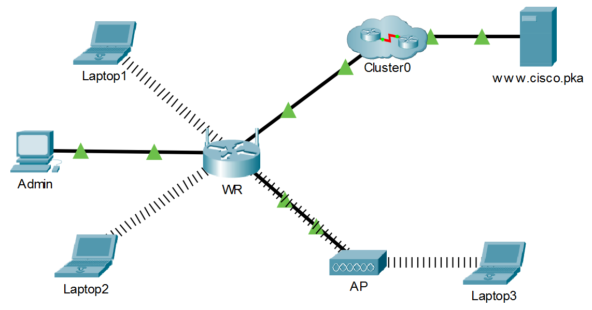

# 📶 Lab09 — Redes Inalámbricas

> Laboratorio 09 — Redes y Comunicación de Datos II | UTP Lima


---

## 📝 Descripción

Laboratorio de configuración de **redes inalámbricas** usando un router inalámbrico y un punto de acceso en Cisco Packet Tracer. Se configuran parámetros SSID, seguridad WPA2, DHCP y se conectan múltiples clientes inalámbricos validando conectividad hacia Internet.

---

## 🗺️ Topología de red



---

## 🎯 Objetivos

- Conectar y configurar un router inalámbrico (WR)
- Configurar SSID `aCompany` en frecuencia 2.4 GHz canal 6
- Implementar seguridad WPA2-PSK con encriptación AES
- Conectar laptops al router inalámbrico y al Access Point
- Configurar y cambiar el rango DHCP de 192.168.0.0/24 a 192.168.50.0/24
- Verificar conectividad hacia `www.cisco.pka`

---

## 🧠 Conceptos aplicados

| Concepto | Detalle |
|---|---|
| 📶 SSID | Red `aCompany` en 2.4 GHz, canal 6 |
| 🔐 WPA2-PSK | Passphrase `Cisco123!` con encriptación AES |
| 📡 Access Point | AP extendiendo la red inalámbrica con mismo SSID |
| 🌐 DHCP | Rango 192.168.50.100 – 192.168.50.149 |
| 🔌 Internet | IP estática 209.165.200.225/30 en puerto WAN |
| 🔑 Admin | Acceso GUI via 192.168.0.1 → 192.168.50.1 |

---

## 🖥️ Direccionamiento IP

| Dispositivo | Interfaz | IP |
|---|---|---|
| WR | Puerto Internet | 209.165.200.225/30 |
| WR | LAN (inicial) | 192.168.0.1/24 |
| WR | LAN (final) | 192.168.50.1/24 |
| DNS Server | — | 209.165.201.1 |
| Laptop1, 2 | Wi-Fi (WR) | DHCP |
| Laptop3 | Wi-Fi (AP) | DHCP |

---

## 📁 Contenido

```
Lab09_Redes_Inalambricas/
│
├── *.pkt          # Archivo de topología Cisco Packet Tracer
├── topologia.png  # Diagrama de red
└── README.md
```

---

## 🚀 ¿Cómo abrir el laboratorio?

1. Instala [Cisco Packet Tracer](https://www.netacad.com/courses/packet-tracer)
2. Abre el archivo `.pkt` incluido en esta carpeta
3. Verifica la conectividad inalámbrica desde las laptops hacia `www.cisco.pka`

---

## 🔙 Volver al índice

[← Volver al repositorio principal](../README.md)
